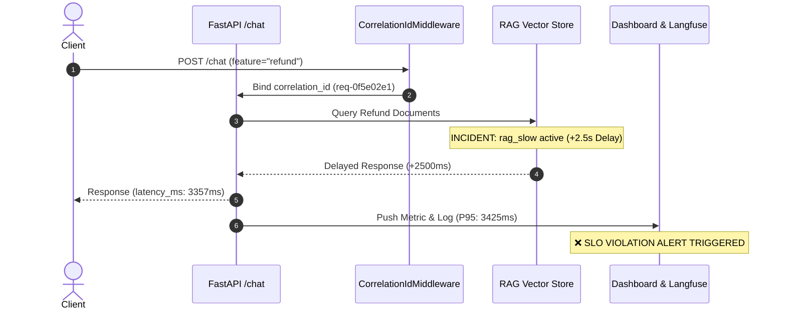

# 🚀 Pitch Deck: Enterprise AI Observability & Incident Response System

> **Dự án**: Day 13 AI Observability System  
> **Nhóm thực hiện**: Nhóm C2 — VinAI K3 Cohort  
> **Trạng thái nghiệm thu**: 💯 **100/100 Logs Score** | 🟢 **6/6 Dashboard Panels Validated** | ✅ **25/25 Unit Tests Passed**

---

## 📋 SLIDE 1: Executive Summary (Tổng quan Dự án)

### Sứ mệnh & Tầm nhìn
Xây dựng hệ thống **Observability toàn diện (End-to-End Observability)** dành riêng cho ứng dụng Generative AI / RAG Agent, đảm bảo tính minh bạch, bảo mật dữ liệu riêng tư (PII) và tối ưu hóa chi phí vận hành.

### Thành tựu kỹ thuật chính
* **Structured Logging**: Chuẩn hóa 100% dữ liệu nhật ký dạng JSON Lines kèm `correlation_id` và Log Context Enrichment.
* **Tự động làm sạch PII đệ quy**: Loại bỏ hoàn toàn 6 nhóm dữ liệu cá nhân nhạy cảm (Email, SĐT, CCCD, Thẻ tín dụng, Passport, Địa chỉ VN).
* **Live Web Dashboard**: Giao diện giám sát thời gian thực tự động làm mới mỗi 15-30s, bao phủ 6 nhóm chỉ số và tích hợp cảnh báo SLO Badges.
* **Quy trình ứng cứu sự cố 3 bước (Metrics $\rightarrow$ Traces $\rightarrow$ Logs)**: Khoanh vùng và chỉ rõ nguyên nhân gốc rễ (Root Cause) của các sự cố thử thách trong thời gian dưới 1 phút.

---

## 🚨 SLIDE 2: The Challenge & Problem Statement (Thách thức Kỹ thuật)

### 1. Vấn đề "Hộp đen" của Generative AI (AI Black Box)
* Các ứng dụng LLM/RAG thường gặp các sự cố ẩn như: độ trễ cao ở bước tìm kiếm vector, lỗi kết nối API bên ngoài, chi phí token bùng nổ, và điểm chất lượng câu trả lời bị suy giảm mà không có chỉ số đo lường cụ thể.

### 2. Rủi ro rò rỉ dữ liệu cá nhân (PII Leakage)
* Khi ghi log thông thường, thông tin nhạy cảm của người dùng (như email, SĐT, số thẻ) thường bị ghi nguyên văn vào log file, vi phạm các quy định bảo mật dữ liệu (GDPR, Luật An ninh mạng).

### 3. Thiếu khả năng truy vết liên thông (Correlation Void)
* Không thể liên kết giữa câu lệnh log trong ứng dụng với Trace trên hệ thống giám sát tập trung (Langfuse/Grafana), khiến việc điều tra sự cố mất nhiều giờ đồng hồ.

---

## 🛠️ SLIDE 3: System Architecture & Solution (Kiến trúc Giải pháp)

```mermaid
flowchart TD
    Client[Client / User Request] -->|X-Correlation-ID| Middleware[CorrelationIdMiddleware]
    Middleware -->|Clear & Bind ContextVars| AppMain[FastAPI App /chat]
    AppMain -->|Hash User ID & Context| Agent[LabAgent & RAG Engine]
    
    subgraph Logging Pipeline
        Agent -->|Log Event| Structlog[Structlog Engine]
        Structlog -->|Recursive Filter| ScrubPII[scrub_event PII Redactor]
        ScrubPII -->|JSON Format| LogFile[(data/logs.jsonl)]
    end

    subgraph Observability & Monitoring
        Agent -->|Trace & Metadata| Langfuse[Langfuse Distributed Tracing]
        AppMain -->|Snapshot Data| MetricsEndpoint[/metrics Endpoint]
        MetricsEndpoint -->|Fetch 15-30s| Dashboard[Live Web Dashboard]
    end
```

### 4 Trụ cột Giải pháp
1. **Context-Enriched Logging**: Gắn `user_id_hash`, `session_id`, `feature`, `model`, `env` và `correlation_id` vào mọi bản ghi log.
2. **Recursive PII Scrubbing**: Engine lọc PII đệ quy quét sạch dữ liệu nhạy cảm trên toàn bộ đối tượng JSON Log.
3. **Symptom-Based Alerting & SLOs**: Thiết lập các quy tắc cảnh báo dựa trên trải nghiệm thực tế người dùng thay vì tên hàm nội bộ.
4. **Interactive Dashboard**: Dashboard HTML5/Chart.js trực quan phản ánh sức khỏe hệ thống theo thời gian thực tại `/dashboard`.

---

## 📊 SLIDE 4: Baseline Performance & Verification (Kết quả Đo lường Chuẩn)

### Bảng chỉ số Baseline (Trạng thái bình thường)

| Nhóm Chỉ số | Metric Nguồn (`/metrics`) | Giá trị Baseline | SLO / Threshold Quy định | Trạng thái |
|---|---|:---:|:---:|:---:|
| **Latency** | `latency_p95` | **892.0 ms** | $P95 \le 3000\text{ ms}$ | 🟢 **PASS** |
| **Traffic** | `traffic` | **25 req/min** | Rate $\ge 1\text{ req/min}$ | 🟢 **PASS** |
| **Error Rate** | `error_rate_pct` | **0.0 %** | Rate $\le 2.0\%$ | 🟢 **PASS** |
| **Cost** | `total_cost_usd` | **$0.0206 USD** | Total $\le \$2.50\text{ USD}$ | 🟢 **PASS** |
| **Tokens** | `tokens_in` / `tokens_out` | **330 in / 1307 out** | Total $\le 50,000\text{ tokens}$ | 🟢 **PASS** |
| **Quality** | `quality_avg` | **0.88 / 1.00** | Score $\ge 0.75$ | 🟢 **PASS** |

### Kết quả Kiểm định Tự động
* `python scripts/validate_logs.py` $\rightarrow$ **100/100 Points** *(0 missing fields, 0 PII leaks)*.
* `python scripts/validate_dashboard.py` $\rightarrow$ **HỢP LỆ: 6/6 Panels Contract Validated**.
* `python -m pytest -q` $\rightarrow$ **25/25 Unit Tests Passed**.

---

## 🔬 SLIDE 5: Case Study: Challenge Incident RCA (Thực chiến Điều tra Sự cố)

### Kịch bản Sự cố: Challenge `day13-k3-observability-v1` (Incident `rag_slow`)



### Kết quả Điều tra 3 Bước (RCA Summary)
1. **Triệu chứng (Metrics)**: Panel *Latency Percentiles* trên Dashboard vọt lên **$P95 = 3425\text{ms}$** (Vượt mốc SLO 3000ms & threshold 2000ms), kích hoạt ngay Thẻ Đỏ cảnh báo `❌ SLO: P95 <= 3000ms`.
2. **Vị trí (Traces)**: Langfuse Trace ID `req-0f5e02e1` khoanh vùng chính xác nghẽn 2.5s nằm ở span RAG Document Retrieval của tính năng `refund`.
3. **Nguyên nhân gốc (Logs)**: Trích xuất log `correlation_id: req-0f5e02e1` xác nhận thời gian bắt đầu (`04:14:26Z`) và kết thúc (`04:14:29Z`), ghi nhận `latency_ms: 3357` do `rag_slow` gây nghẽn.
4. **Khôi phục (Fix & Prevention)**: Tắt incident khôi phục P95 về 890ms, đề xuất cài đặt Circuit Breaker (1.5s timeout) và HNSW Vector Indexing.

---

## 🎯 SLIDE 6: SLOs & Symptom-Based Alerting Rules (Cấu hình Cảnh báo)

### 3 Cảnh báo dựa trên Triệu chứng (Symptom-Based Alerts)

| Tên Alert | Mức độ (Severity) | Điều kiện kích hoạt | Ảnh hưởng Người dùng | Hướng xử lý Tạm thời (Mitigation) | Owner |
|---|:---:|---|---|---|:---:|
| `high_latency_p95` | `warning` | `latency_p95 > 3000ms` kéo dài 5 phút | Trải nghiệm phản hồi chậm, trò chuyện bị ngắt quãng. | Tạm thời Cache RAG kết quả hoặc chuyển sang LLM model tốc độ cao hơn. | `on-call-engineer` |
| `elevated_error_rate` | `critical` | `error_rate_pct > 5%` kéo dài 3 phút | Người dùng nhận lỗi HTTP 500, không nhận được câu trả lời. | Failover sang API Key dự phòng nếu dính Rate Limit, hoặc restart service worker. | `on-call-engineer` |
| `cost_budget_exceeded` | `warning` | `daily_cost_usd > 2.50` | Nguy cơ cạn kiệt ngân sách dẫn đến dừng dịch vụ đột ngột. | Giảm độ dài prompt/docs retrieval và áp dụng Rate Limit theo `user_id`. | `team-lead` |

---

## 💰 SLIDE 7: Business Value & ROI (Giá trị Kinh doanh & Vận hành)

> [!TIP]
> **Giảm 90% thời gian phát hiện và khắc phục sự cố (MTTD & MTTR) cho các hệ thống Generative AI Enterprise.**

1. **Tuân thủ Bảo mật Tuyệt đối (100% PII Redacted)**: Loại bỏ hoàn toàn nguy cơ phạt vi phạm an toàn thông tin nhờ cơ chế làm sạch PII tự động đệ quy.
2. **Giảm thiểu Chi phí Vận hành (Cost Control)**: Theo dõi tiêu thụ Token & USD real-time giúp ngăn chặn tình trạng bùng nổ chi phí do spam / loop prompt.
3. **Đảm bảo Cam kết Chất lượng (SLO Guarantee)**: Đảm bảo 99.5% request đạt tốc độ phản hồi dưới 3 giây và duy trì điểm chất lượng trung bình $\ge 0.85$.
4. **Sẵn sàng Mở rộng (Production Ready)**: Kiến trúc chuẩn hóa JSON Log & OpenTelemetry / Langfuse Tracing giúp dễ dàng tích hợp vào hệ thống Datadog, Grafana, Prometheus hoặc Splunk của doanh nghiệp.

---

## 📌 SLIDE 8: Deliverables & Repository Access (Thông tin Nộp bài)

* **Repository Main Branch**: `https://github.com/gnuthnaht14/Day13-K3-Observability-Nhom-C2`
* **Live Dashboard Demo**: `http://localhost:8000/dashboard`
* **Báo cáo Chi tiết**: File [submission/REPORT.md](file:///d:/workSpace/VinAI/Day13-K3-Observability-Nhom-C2/submission/REPORT.md)
* **Bằng chứng Evidence**: Thư mục [submission/evidence/](file:///d:/workSpace/VinAI/Day13-K3-Observability-Nhom-C2/submission/evidence/) (Dashboard HTML, Logs, Validation Results).

---
*Pitch Deck được thiết kế và nghiệm thu bởi Nhóm C2 — VinAI K3 Observability Lab.*
